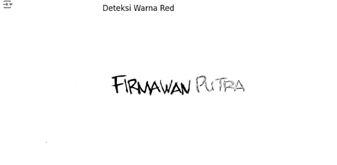

# PROJECT UTS PENGOLAHAN CITRA 2024

Dalam proyek UTS pengolahan citra kali ini, kita akan menjelajahi teknik deteksi warna dalam citra. Tugasnya adalah mengurutkan ambang batas warna dari yang paling rendah hingga yang tertinggi.
## 1. DETEKSI WARNA PADA CITRA
- Import library :

import cv2
import numpy as np
import matplotlib.pyplot as plt

-	Kode tersebut mengimpor tiga pustaka yang berbeda:
1. cv2, yang merupakan OpenCV, digunakan untuk manipulasi dan analisis citra.
2. matplotlib.pyplot as plt, bagian dari Matplotlib, digunakan untuk membuat plot dan visualisasi data.
3. numpy as np, NumPy, digunakan untuk operasi numerik dan pengolahan array.

- Selanjutnya, kode tersebut membaca data gambar dengan menggunakan kode di bawah ini:
  img = cv2.imread('gambar_nama.jpg')
  img_rgb = cv2.cvtColor(img, cv2.COLOR_BGR2RGB)
  hsv_img = cv2.cvtColor(img, cv2.COLOR_BGR2HSV)

-	Kode tersebut ditujukan untuk membaca file gambar dengan nama "parking_lot.jpeg" dan kemudian menyimpannya dalam variabel img menggunakan pustaka OpenCV.

- Fungsi cv2.cvtColor(img, cv2.COLOR_BGR2RGB) digunakan untuk mengubah ruang warna gambar. Pada kasus ini, gambar yang telah dibaca sebelumnya (img) dikonversi dari format BGR (Blue-Green-Red) ke format RGB (Red-Green-Blue). Hal ini dilakukan karena OpenCV secara default membaca gambar dalam format BGR, tetapi dalam banyak kasus, format RGB lebih disukai untuk analisis dan visualisasi.

- Fungsi cv2.cvtColor(img, cv2.COLOR_BGR2HSV) juga digunakan untuk mengubah ruang warna, namun kali ini mengonversi gambar dari format BGR ke format HSV (Hue-Saturation-Value). Model warna HSV sangat berguna dalam pengolahan citra, terutama untuk deteksi warna, karena memisahkan informasi warna (hue), kejenuhan (saturation), dan nilai (value/brightness). Hal ini memungkinkan kita untuk lebih mudah dan efektif dalam mendeteksi dan memanipulasi warna dalam citra.

- Setelah itu, kita mendefinisikan rentang warna untuk semua warna yang akan dideteksi.

- Semua langkah tersebut bertujuan untuk mendefinisikan tingkat kecerahan dan kegelapan dari setiap warna yang akan diidentifikasi.

- Langkah selanjutnya adalah mendeklarasikan warna-warna yang akan digunakan untuk proses deteksi warna.

- semua ini warna ini akan digunakan untuk mendeteksi warna yang telah ditentukan

## Tampilkan gambar dan hasil deteksi warna

- Berikut adalah cara menampilkan gambar asli menggunakan

### Penjelasan
Pernyataan plt.figure(figsize=(30, 8)) membentuk sebuah figure baru yang akan digunakan untuk menampilkan plot. Parameter figsize=(30, 8) menentukan dimensi dari figure dalam satuan inci, di mana nilai pertama mewakili lebar dan nilai kedua mewakili tinggi. Dengan nilai tersebut, ukuran figure yang dihasilkan adalah 30x8 inci.

plt.subplot(1, 4, 1) menetapkan grid plot dengan satu baris dan empat kolom, dan menunjukkan bahwa kita akan memplot pada subplot pertama.

plt.imshow(img_rgb) menampilkan gambar yang telah diubah formatnya menjadi RGB dalam subplot yang telah ditentukan sebelumnya.

plt.title('Original Image'): Ini memberikan judul pada plot, dalam hal ini "Original Image".

plt.title('Original Image') memberikan judul "Original Image" pada plot yang sedang ditampilkan.

plt.show() digunakan untuk menampilkan plot yang telah dibuat kepada pengguna.

## Deteksi warna biru

- ini gambar deteksi warna biru dengan cara menampilkannya code sebagai berikut :

### Penjelasan
Pernyataan plt.figure(figsize=(30, 8)) membuat sebuah figure baru dengan ukuran 30x8 inci, sama seperti sebelumnya.

Pernyataan plt.subplot(1, 4, 2) menunjukkan bahwa kita akan membuat sebuah grid plot dengan satu baris dan empat kolom, dan akan memplot pada subplot kedua dari grid tersebut.

Pernyataan plt.imshow(mask_blue_inv, cmap='gray') menampilkan gambar mask_blue_inv di subplot yang telah ditentukan sebelumnya. Namun, dengan menggunakan cmap='gray', colormap diatur menjadi grayscale, sehingga gambar akan ditampilkan dalam skala keabuan.

plt.title('Deteksi Warna Blue') memberikan judul "Deteksi Warna Blue" pada plot yang sedang ditampilkan.

plt.axis('off'): Menghilangkan sumbu x dan y pada plot, sama seperti sebelumnya.

plt.show() digunakan untuk menampilkan plot yang telah dibuat kepada pengguna.

## Deteksi warna merah

- ini gambar deteksi warna biru dengan cara menampilkannya code sebagai berikut :

### Penjelasan
Pernyataan plt.figure(figsize=(30, 8)) membuat sebuah figure baru dengan ukuran 30x8 inci, sama seperti sebelumnya.

Pernyataan plt.subplot(1, 4, 3) menetapkan subplot ke-3 dalam grid plot dengan 1 baris dan 4 kolom.

plt.imshow(mask_red_inv, cmap='gray') digunakan untuk menampilkan gambar hasil deteksi warna merah, mask_red_inv, di subplot yang telah ditentukan sebelumnya. Dengan menggunakan cmap='gray', gambar akan ditampilkan dalam skala keabuan (grayscale).

plt.title('Deteksi Warna Red') memberikan judul "Deteksi Warna Red" pada plot yang sedang ditampilkan.

plt.axis('off') digunakan untuk menghilangkan sumbu x dan y pada plot, yang sama seperti langkah sebelumnya.

plt.show() digunakan untuk menampilkan plot yang telah dibuat kepada pengguna.

## Deteksi warna hijau

- ini gambar deteksi warna biru dengan cara menampilkannya code sebagai berikut :

### Penjelasan
plt.figure(figsize=(30, 8)) digunakan untuk membuat sebuah figure baru dengan ukuran 30x8 inci.

plt.subplot(1, 4, 4) mengatur subplot keempat dalam tata letak grid satu baris dan empat kolom.

plt.imshow(mask_green_inv, cmap='gray'): Menampilkan gambar hasil deteksi warna hijau, mask_green_inv, di subplot yang telah ditentukan sebelumnya. Dengan cmap='gray', gambar ditampilkan dalam skala keabuan (grayscale).

Pernyataan plt.title('Deteksi Warna Green') memberikan judul "Deteksi Warna Green" pada plot yang sedang ditampilkan.

Pernyataan plt.axis('off') menghilangkan sumbu x dan y pada plot..

plt.show(): Menampilkan plot yang telah dibuat.

## 2. URUTKAN AMBANG BATAS TERKECIL SAMAPAI DENGAN TERBESAR
- berikut urutkan ambang batas terkecil samapi dengan terbesar

### None
  

### blue
  

### red-blue
  

### red-green-blue
  
  

## Hasil Nilai Ambang
  

### Penjelasan

hue_channel = hsv_img[:,:,0]: Ini mengambil saluran Hue (saluran pertama) dari gambar yang telah dikonversi ke ruang warna HSV.

Pernyataan hue_channel = hsv_img[:,:,0] mengambil saluran Hue (saluran pertama) dari gambar yang telah dikonversi ke ruang warna HSV.

_, red1_thresh = cv2.threshold(hue_channel, 0, 10, cv2.THRESH_BINARY) digunakan untuk menemukan ambang batas yang sesuai dengan warna merah (bagian 1) dengan menerapkan proses thresholding pada saluran Hue. Karena rentang Hue yang merepresentasikan warna merah terletak dekat dengan nilai 0 dan 180, yang merupakan batas dari model warna HSV yang berbentuk lingkaran, proses thresholding dilakukan pada rentang nilai antara 0 hingga 10.

_, Untuk menemukan ambang batas yang sesuai dengan warna merah (bagian 2), digunakan pernyataan red2_thresh = cv2.threshold(hue_channel, 170, 180, cv2.THRESH_BINARY). Pernyataan ini menerapkan proses thresholding pada saluran Hue, dimana nilai threshold diletakkan di antara rentang 170 hingga 180. Hal ini disesuaikan dengan sifat lingkaran dari model warna HSV

_, Pernyataan green_thresh = cv2.threshold(hue_channel, 40, 80, cv2.THRESH_BINARY) digunakan untuk menemukan ambang batas yang sesuai dengan warna hijau dengan menerapkan proses thresholding pada saluran Hue. Rentang Hue yang umumnya mewakili warna hijau adalah antara 40 hingga 80.

all_thresholds = np.unique(np.concatenate((blue_thresh, red1_thresh, red2_thresh, green_thresh))): Menggabungkan semua ambang batas yang telah ditemukan untuk setiap warna, dan kemudian menghapus duplikatnya menggunakan np.unique.

sorted_thresholds = np.sort(all_thresholds): Mengurutkan ambang batas dari yang terkecil hingga yang terbesar.

print("Ambang Batas Terkecil hingga Terbesar:"): Mencetak pesan untuk memberi tahu bahwa hasil berikutnya adalah ambang batas yang telah diurutkan.

print(sorted_thresholds): Mencetak ambang batas yang telah diurutkan.

## Histogram
untuk menampilkan histogram pada gambar cukup lakukan code pada gambar dibawah ini lalu hasilnya kan seperti ini :

### Hasil Histogram

### Penjelasan
-Langkah pertama menggunakan hist() adalah menampilkan gambar asli pada subplot (0,0) dengan pernyataan axs[0,0].imshow(img). Kemudian, histogram gambar dihitung dan ditampilkan menggunakan fungsi hist() dari matplotlib pada subplot (0,1). Untuk itu, digunakan img.ravel() untuk meratakan array gambar menjadi satu dimensi, diikuti oleh jumlah bin (256) dan rentang nilai (0-256).

- Cara 2 menggunakan calcHist():
hist = cv2.calcHist([img],[0],None,[256],[0,256]): Ini menghitung histogram gambar menggunakan fungsi calcHist() dari OpenCV. Argumen pertama adalah daftar gambar, argumen kedua adalah indeks saluran warna (0 untuk grayscale), argumen ketiga adalah mask (None untuk gambar lengkap), argumen keempat adalah jumlah bin, dan argumen kelima adalah rentang nilai.
axs[1,0].imshow(img): Menampilkan gambar asli pada subplot (1,0).
axs[1,1].plot(hist): Ini menampilkan plot histogram yang telah dihitung menggunakan calcHist().

# Selesai :)